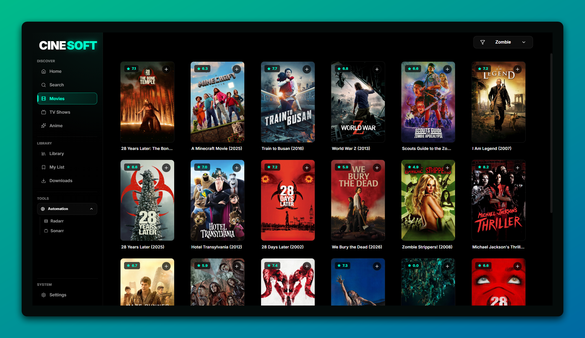
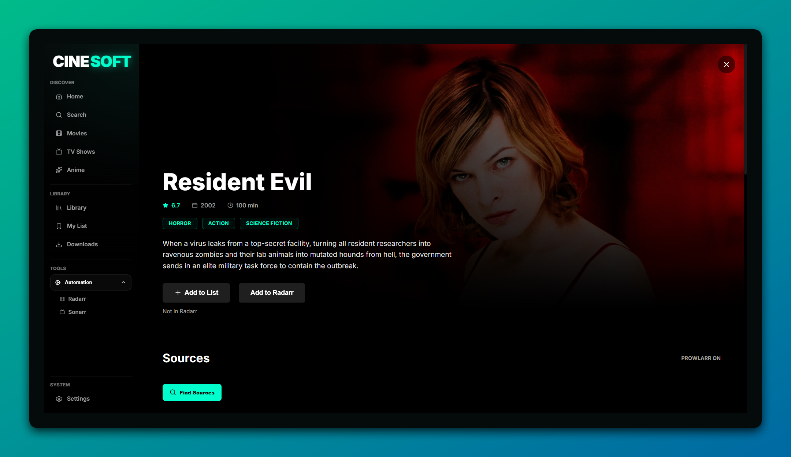
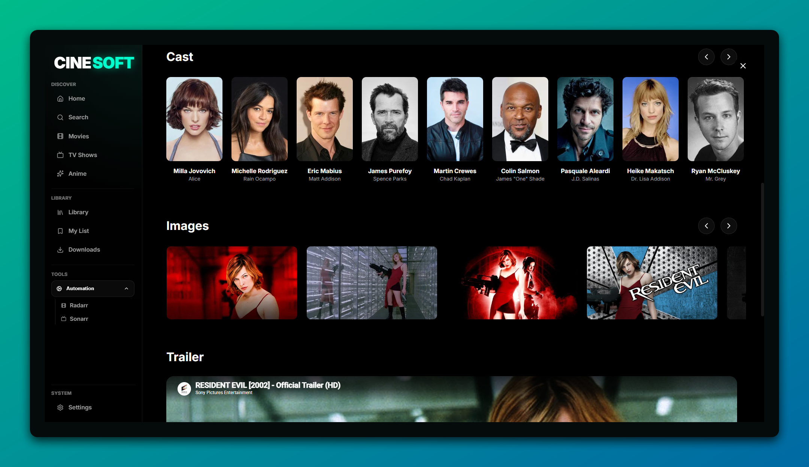
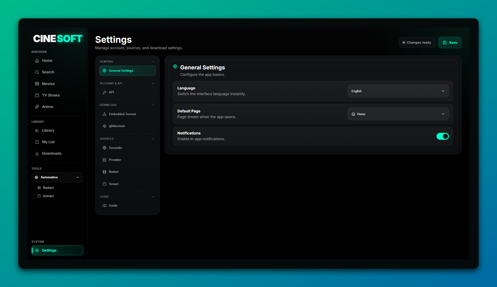
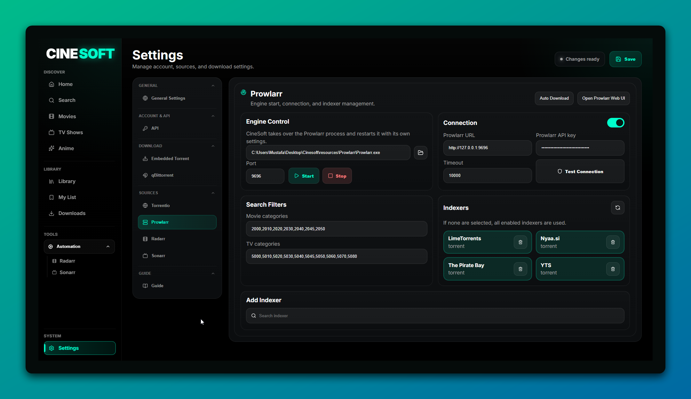

# CineSoft

CineSoft is a desktop application developed for searching sources and downloading torrents for movies, TV shows, and anime.

The application brings content search, detail viewing, source discovery, and torrent downloading together in a single interface.  
For now, CineSoft is focused only on torrent downloading. Media player and streaming features are not included.

---

## ✨ Features

- Search for movies, TV shows, and anime
- View content details
- Search sources for TV show and anime episodes
- List torrent sources
- Start torrent downloads
- Track downloads
- Settings screen
- No extra API input required for AniList integration
- Prowlarr-based source search support

---
## Screenshots

### Home & Movies

<p align="center">
  
  
</p>

### Detail Page

<p align="center">
  
  
</p>

### Settings

<p align="center">
  
  
</p>

## Requirements

To run CineSoft, the following must be installed on your computer:

- [Node.js](https://nodejs.org/)
- [Git](https://git-scm.com/)
- Windows operating system
- Prowlarr files, optional for source search

---

## Installation

Clone the project to your computer:

```powershell
git clone https://github.com/Margthus/Cinesoft
cd Cinesoft
```

Install the dependencies:

```powershell
npm install
```

---

## 1. Prowlarr Setup Optional

Go to the Prowlarr GitHub page:

https://github.com/Prowlarr/Prowlarr

Then open the Releases section and download the appropriate `.zip` file for Windows.

---

## 2. Extract the ZIP File

Extract the downloaded Prowlarr ZIP file.

---

## 3. Place the Files Inside the Resources Folder

The project root directory should contain a folder structure like this:

```text
Cinesoft/
├─ resources/
│  └─ prowlarr/
│     ├─ Prowlarr.exe
│     └─ ...
├─ src/
├─ main.js
├─ preload.js
├─ package.json
└─ README.md
```

The `resources/prowlarr/` folder is not included in the repository.  
This folder must be created manually by the user.

---

## Starting the Application

After installing the dependencies, start the application with:

```powershell
npm start
```

If you want to use Prowlarr-based source search, make sure the Prowlarr files are placed inside:

```text
resources/prowlarr/
```

---

# Türkçe

CineSoft, film, dizi ve anime içerikleri için geliştirilmiş masaüstü kaynak arama ve torrent indirme uygulamasıdır.

Uygulama; içerik arama, detay görüntüleme, kaynak bulma ve torrent indirme akışını tek bir arayüzde toplar.  
Şimdilik CineSoft yalnızca torrent indirme odaklı çalışır. Medya oynatıcı ve izleme özellikleri dahil değildir.

---

## ✨ Özellikler

- Film, dizi ve anime içeriklerini arama
- İçerik detaylarını görüntüleme
- Dizi ve anime bölümleri için kaynak arama
- Torrent kaynaklarını listeleme
- Torrent indirme başlatma
- İndirilenleri takip etme
- Ayarlar ekranı
- AniList entegrasyonu için ekstra API girişi gerekmez
- Prowlarr tabanlı kaynak arama desteği

---
## Screenshots

### Home & Movies

<p align="center">
  
  
</p>

### Detail Page

<p align="center">
  
  
</p>

### Settings

<p align="center">
  
  
</p>

## Gereksinimler

CineSoft’u çalıştırmak için bilgisayarınızda şunlar kurulu olmalıdır:

- [Node.js](https://nodejs.org/)
- [Git](https://git-scm.com/)
- Windows işletim sistemi
- Kaynak arama için isteğe bağlı Prowlarr dosyaları

---

## Kurulum

Projeyi bilgisayarınıza klonlayın:

```powershell
git clone https://github.com/Margthus/Cinesoft
cd Cinesoft
```

Bağımlılıkları kurun:

```powershell
npm install
```

---

## 1. Prowlarr Kurulumu İsteğe Bağlı

Prowlarr GitHub sayfasına gidin:

https://github.com/Prowlarr/Prowlarr

Ardından Releases bölümünden Windows için uygun `.zip` dosyasını indirin.

---

## 2. ZIP Dosyasını Çıkartın

İndirdiğiniz Prowlarr ZIP dosyasını çıkartın.

---

## 3. Dosyaları Resources Klasörüne Yerleştirin

Proje ana dizininde klasör yapısı şu şekilde olmalıdır:

```text
Cinesoft/
├─ resources/
│  └─ prowlarr/
│     ├─ Prowlarr.exe
│     └─ ...
├─ src/
├─ main.js
├─ preload.js
├─ package.json
└─ README.md
```

`resources/prowlarr/` klasörü repoya dahil edilmez.  
Bu klasör kullanıcı tarafından manuel olarak oluşturulmalıdır.

---

## Uygulamayı Başlatma

Bağımlılıkları kurduktan sonra uygulamayı şu komutla başlatın:

```powershell
npm start
```

Prowlarr tabanlı kaynak aramayı kullanmak istiyorsanız Prowlarr dosyalarının şu klasöre yerleştirildiğinden emin olun:

```text
resources/prowlarr/
```
