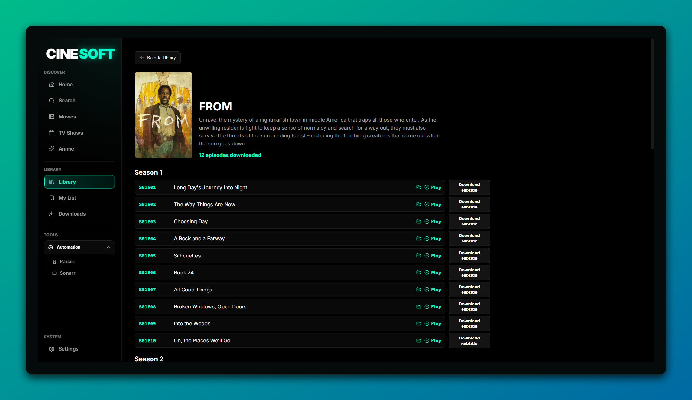
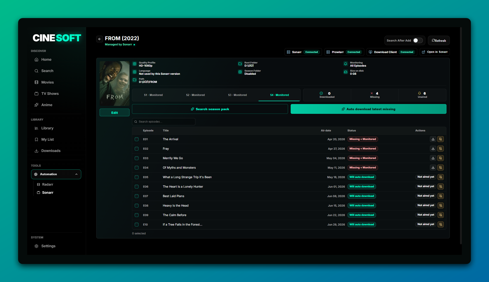
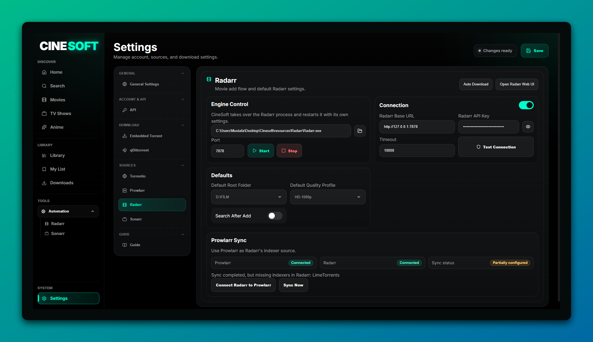
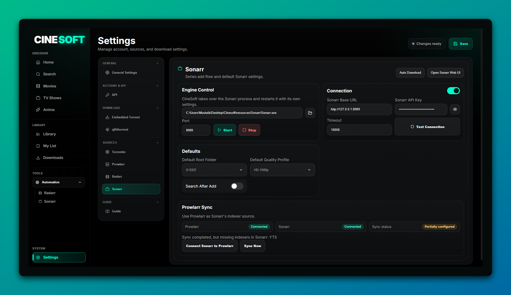
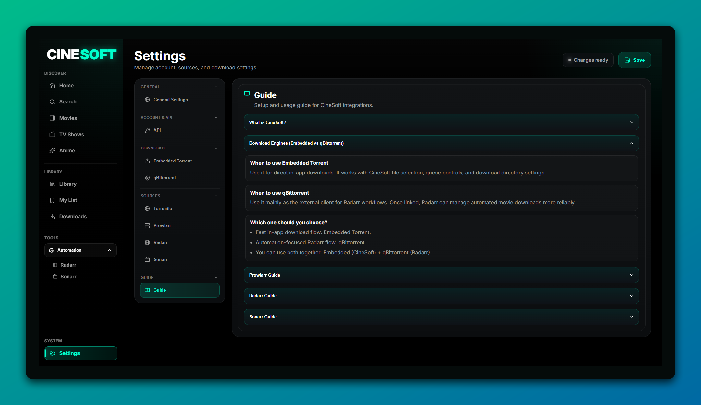
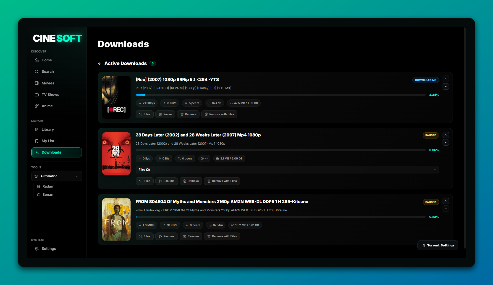

# CineSoft
Vibe Coding
---

## English

### Overview
CineSoft is a Windows desktop media hub built to keep discovery, streaming, downloading, automation, subtitles, and library tracking in one place. It combines TMDB-powered browsing, an embedded libtorrent workflow, optional qBittorrent integration, controllable source search, embedded Arr-stack tools, and in-app playback without splitting the workflow across multiple apps.

### What’s New (Latest Updates)
- Hybrid streaming flow with TorrServer, embedded VLC playback, and HTML5 fallback for compatible streams.
- Expanded subtitle flow for both library playback and streaming playback, including embedded subtitle visibility and downloadable subtitle support.
- Reworked settings and side navigation for a cleaner control surface across torrent, streaming, and automation features.
- Stronger Radarr and Sonarr integration, with managed engine workflows and a more complete in-app automation setup.
- One-click installer/download flow for Prowlarr, Radarr, Sonarr, and TorrServer from inside CineSoft.
- Stability and responsiveness improvements across engine control, background tasks, and source-search interactions.
- Dedicated in-app Guide pages for setup, integration, and daily usage flows.

### Features
- Movie, TV-show, and anime discovery in one interface.
- TMDB-powered posters, metadata, cast, trailers, backdrops, and content detail pages.
- Embedded libtorrent download engine with queue control, stop/remove actions, sequential download, file selection, and advanced torrent settings.
- Optional qBittorrent Web UI integration for users who prefer an external torrent client workflow.
- Source search from the content detail page using either Torrentio or Prowlarr.
- Prowlarr search flow that can be managed directly inside CineSoft, including controllable indexer selection and configuration.
- Preview torrent contents before download and choose exactly which file(s) to download.
- Separate stream and download flows so streaming sessions do not pollute the download list.
- TorrServer-based streaming with CineSoft’s in-app player shell.
- Embedded VLC playback for broad format support, with HTML5 playback fallback for compatible stream types.
- In-app player controls for stream playback, including subtitle menus and player-state handling.
- OpenSubtitles-powered subtitle search and download for both library playback and streaming playback.
- Embedded subtitle visibility inside the CineSoft player when the media already includes subtitle tracks.
- Personal library view for downloaded content, with quick access to local playback workflows.
- My List page with watch-state organization such as watched, want to watch, and dropped.
- Embedded Arr-stack workflow with Radarr and Sonarr support for automated movie and TV management.
- In-app automation settings for Radarr and Sonarr, including managed-engine control and setup guidance.
- Engine installer flows that can download, unpack, and wire supported tools directly from CineSoft.
- System tray behavior, minimize-to-tray options, and app-lifecycle controls for background usage.
- Built-in Guide page that explains setup, integration, and common daily workflows.
- Bilingual interface with English and Turkish support.

### Screenshots

#### Home & Movies
<p align="center">
  
  
</p>

#### Detail & Library
<p align="center">
  
  
</p>
<p align="center">
  
  
</p>

#### Settings
<p align="center">
  
  
</p>
<p align="center">
  
  
</p>

#### Guide & Downloader
<p align="center">
  
  
</p>

### Installation
> `.exe` distribution is no longer provided.  
> Because of recurring Windows SmartScreen/code-signing friction, CineSoft is now installed and run via source + npm only.

```powershell
git clone https://github.com/Margthus/Cinesoft
cd Cinesoft
npm install
npm start
```

### Requirements
- [Node.js](https://nodejs.org/) 18+
- [npm](https://www.npmjs.com/) 9+
- [Git](https://git-scm.com/)
- Windows
- TMDB API key (required for metadata, posters, trailers, and detail pages)
- Optional: Python 3.11+ for local helper services used by some flows
- Optional: qBittorrent for external download-client usage
- Optional: Prowlarr, Radarr, Sonarr, and TorrServer if you do not want CineSoft to manage installation for you
- TorrServer executable configured in Settings (required for streaming)

### TMDB API Key (Required)
Get your own API key from TMDB:

https://www.themoviedb.org/settings/api

Then add it from the app Settings page.

### Build (Developer)
```powershell
npm run build
```

### Roadmap
- Partial streaming infrastructure
- Manga viewing and reading
- Comics viewing and reading

---

## Türkçe

### Genel Bakış
CineSoft; keşif, streaming, indirme, otomasyon, altyazı ve kütüphane takibini tek yerde toplayan bir Windows masaüstü medya merkezidir. TMDB tabanlı içerik gezintisini, gömülü libtorrent indirme akışını, isteğe bağlı qBittorrent kullanımını, tamamen kontrol edilebilir kaynak aramayı, gömülü Arr-stack araçlarını ve uygulama içi oynatmayı tek deneyimde birleştirir.

### Neler Yeni (Son Güncellemeler)
- TorrServer, gömülü VLC oynatma ve uyumlu streamlerde HTML5 fallback ile hibrit streaming akışı eklendi.
- Hem kütüphane oynatımında hem stream oynatımında daha güçlü altyazı akışı, gömülü altyazı görünürlüğü ve indirilebilir altyazı desteği geliştirildi.
- Ayarlar sayfası ve yan menü; torrent, streaming ve otomasyon özelliklerini daha rahat yönetmek için yeniden düzenlendi.
- Radarr ve Sonarr entegrasyonları, managed-engine akışlarıyla birlikte daha kapsamlı hale getirildi.
- Prowlarr, Radarr, Sonarr ve TorrServer için CineSoft içinden tek tuşla indirme/kurulum akışları eklendi.
- Engine kontrolü, arka plan işlemleri ve kaynak arama etkileşimlerinde genel stabilite ve tepki süresi iyileştirildi.
- Kurulum, entegrasyon ve günlük kullanım için uygulama içi Guide sayfaları genişletildi.

### Özellikler
- Film, dizi ve anime içeriklerini tek arayüzde keşfetme.
- TMDB tabanlı afişler, metadata, oyuncular, fragmanlar, arka plan görselleri ve detay sayfaları.
- Gömülü libtorrent indirme motoru ile kuyruk kontrolü, durdurma/silme, sıralı indirme, dosya seçimi ve gelişmiş torrent ayarları.
- Harici torrent istemcisi isteyenler için qBittorrent Web UI entegrasyonu.
- İçerik detay sayfasından Torrentio veya Prowlarr ile kaynak arama.
- Prowlarr aramasını CineSoft içinden yönetebilme; indexer ekleme, çıkarma ve yapılandırma kontrolü.
- İndirme başlamadan önce torrent içeriğini görüp hangi dosyanın indirileceğini seçebilme.
- Stream oturumlarını indirme listesine eklemeden ayrı tutan temiz streaming akışı.
- TorrServer tabanlı uygulama içi streaming sistemi.
- Geniş format desteği için gömülü VLC oynatma, uyumlu stream tipleri için HTML5 oynatma fallback desteği.
- Stream playback için uygulama içi player kontrolleri, altyazı menüleri ve oynatma durum yönetimi.
- Hem kütüphane oynatımında hem streaming oynatımında OpenSubtitles tabanlı altyazı arama ve indirme.
- Medyada zaten bulunan gömülü altyazıları CineSoft player içinde görebilme.
- İndirilen içerikleri listeleyen kişisel Kütüphanem görünümü.
- Listem sayfasında içerikleri izledim, izlemek istiyorum ve bıraktım gibi durumlara ayırabilme.
- Radarr ve Sonarr desteği ile gömülü Arr-stack tabanlı film/dizi otomasyon akışı.
- Radarr ve Sonarr için CineSoft içinden yönetilebilen otomasyon ve engine ayarları.
- Desteklenen araçları CineSoft içinden indirip kurabilen installer akışları.
- Sistem tepsisi desteği, simge durumuna küçültme ve arka planda çalışma davranışları.
- Kurulum, entegrasyon ve günlük kullanım için uygulama içi Guide sayfası.
- Türkçe ve İngilizce çok dilli arayüz.

### Ekran Görüntüleri

#### Ana Sayfa & Filmler
<p align="center">
  
  
</p>

#### Detay & Kütüphane
<p align="center">
  
  
</p>
<p align="center">
  
  
</p>

#### Ayarlar
<p align="center">
  
  
</p>
<p align="center">
  
  
</p>

#### Rehber & Downloader
<p align="center">
  
  
</p>

### Kurulum
> Artık `.exe` dağıtımı yapılmıyor.  
> Windows SmartScreen ve code-signing kaynaklı sürtünme nedeniyle CineSoft yalnızca kaynak kod + npm ile kurulur ve çalıştırılır.

```powershell
git clone https://github.com/Margthus/Cinesoft
cd Cinesoft
npm install
npm start
```

### Gereksinimler
- [Node.js](https://nodejs.org/) 18+
- [npm](https://www.npmjs.com/) 9+
- [Git](https://git-scm.com/)
- Windows
- TMDB API anahtarı (metadata, afiş, fragman ve detay sayfaları için zorunlu)
- İsteğe bağlı: Bazı yardımcı servis akışları için Python 3.11+
- İsteğe bağlı: Harici torrent istemcisi olarak qBittorrent
- İsteğe bağlı: Kurulumu CineSoft’a bırakmak istemiyorsanız Prowlarr, Radarr, Sonarr ve TorrServer

### TMDB API Anahtarı (Zorunlu)
TMDB API anahtarınızı buradan alın:

https://www.themoviedb.org/settings/api

Sonrasında uygulama içindeki Ayarlar sayfasından ekleyin.

### Build (Geliştirici)
```powershell
npm run build
```

